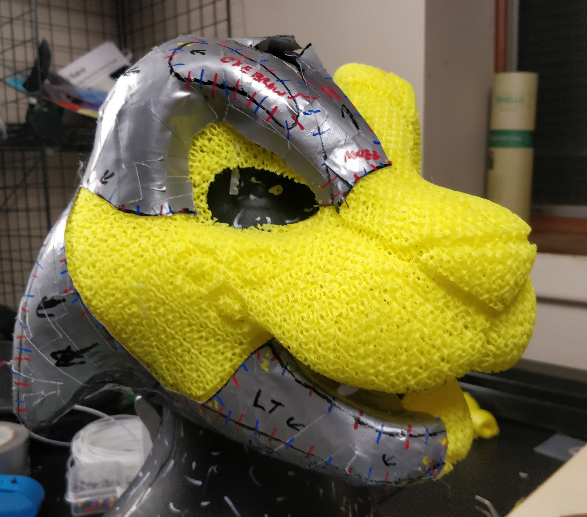

# 3D Printable Foam Resources

## Overview

This repo is a dumping ground of sorts to share the some of my efforts in 3D printing foam-like materials. My initial goal was to develop print profiles and techniques to produce a material functionally similar to traditional reticulated polyurethane foam for costume and cosplay design but with some physical and practical improvements tailored for those applications. Some potential advantages include:

- Variable Density - Since it's an engineered material, printable foam doesn't need to be the same density throughout. Most of the examples included in this repo produce objects with a low density core surrounded by a higher density skin. The core minimizes material usage and allows for a very flexible, well ventilated interior while the skin reproduces more surface detail of the 3D model.
- Strength - Unlike hard 3D prints or resin casts, 3D-printed foam is just as resilient against crushing as reticulated foam, and in my experience is much more tear-resistant than reticulated foam as well.
- Digital workflow - If you're like me, digital modeling (and the ability to Undo) is much easier than hand sculpting. If you need to produce an object with the properties of reticulated foam but prefer digital design to scissors, knives, and glue then this may be a viable alternative for you.
- Embedded Features - It's easy to embed external and internal features such as solid mounting locations for fasteners, passages for routing wires, internal air ducts for ventilation, etc directly into the printed part.

I'm putting this information out there in the hope that it'll give you a good foundation to build on for your own projects.

## Principle of Operation

The provided printer settings and examples make use the gyroid infill pattern provided in PrusaSlicer, with no top or bottom layers and no perimeters. Gyroidal infill printed in TPU produces a very flexible, durable, and isotropic material akin to traditional reticulated foam.

## What do I need to make use of these files?
- A Prusa I3 MK3S or an Ender 3 Pro with direct drive extruder modification
- The lastest version of PrusaSlicer
- TPU filament

## Notes on TPU filaments
The provided examples are tailored for NinjaTek Cheetah TPU. Though I have successfully tested a number of other TPUs with rated shore hardnesses of 95A and above, the softness and elasticity of the final parts were highest with Ninjatek Cheetah. If you plan to experiment with other TPUs I'd suggest Cheetah as the baseline for comparison.

Although Cheetah claims to be Shore 95A durometer and prints similarly to other Shore 95A filaments I have tried, I've done coupon testing on all TPUs I've tried and Cheetah has repeatedly measured about 5 points lower than other filaments, at Shore 90A. If you're looking for other filaments to test this is something to bear in mind.

Additionally, I'd recommend using white or natural colored TPU when possible, as I've found that some colors exhibit more stringing than others even within the same brand, which could be the result of the particular colorants added to the filament during production.

## Notes on various 3D printers
I have provided examples tailored toward a stock Prusa I3 MK3S and an Ender 3 Pro with a basic direct drive extruder conversion kit. Good filament control and precise retraction settings are necessary to reduce stringing when 3d printing foam and for that reason I don't recommend bowden-style extruders at all.

## How fast can I print?
The included PrusaSlicer settings are for 85mm/s on a Prusa I3 and 64mm/s on an Ender 3 Pro with direct drive extruder conversion, and have been reliable for me for several hundred hours of printing so far.
 
## Can you help me?
No, sorry. I'm happy to put this information in the public domain but if you need help ***You're On Your Own***.

## Contributing
Pull requests are welcome.

## License
[AGPL 3.0](https://opensource.org/licenses/AGPL-3.0)